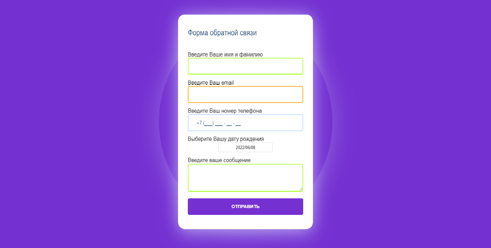

Next.js + GraphQL + Typescript frontend form app.

# Get started
- `git clone ...`
- `npm install`
-  `cp .env_example .env`
- Edit `.env`
- Database workflow
- `npm run dev`
- `npm run gen`
- `npm run dev`

Production build:
- `npm run build`
- `npm start`

# Database workflow
- Change schema: `prisma/schema.prisma`

- Create migration: `npm run prisma:create`

- Deploy migration to database: `npm run prisma:deploy`

## Types generation
Run `npm run gen` after every GraphQL API Schema changed or after `./graphql/*.graphql` files are modified

# Other info
Build info page available at `/_info`: http://localhost:3000/_info
